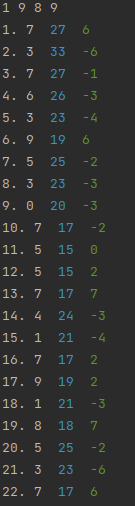
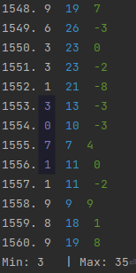
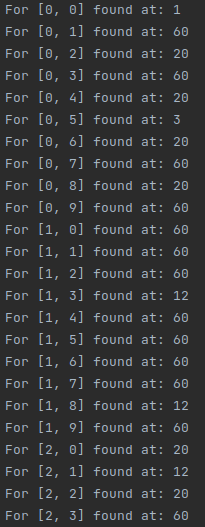

# Zadání 
1. V postupnosti 1, 9, 8, 9, 7, 3, 6, 3, 9 sa každý následujúcí člen začínajúc piatym členom rovná poslednej cifre sůčtu předošlých štyroch členov. Zistite, či sa vystnu ešte raz číslice 1, 9, 8, 9 besprostredne za sebou.

2. V postupnosti 1, 9, 8, 9, 7, 3, 6, 3, 9 sa každý následujúcí člen začínajúc piatym členom rovná poslednej cifre sůčtu předošlých štyroch členov. Zistite, či sa vystnu ešte raz číslice 3, 0, 7, 1 besprostredne za sebou.

# Řešení
Začal jsem počítat sekvenci dále, ale byl jsem si méně a méně jist, že jsem neudělal chybu, proto jsem se rozhodl, že napíšu program, který bude počítat za mě.
## Pozorování
### Zpětný chod
K počítané sekvenci čísel jsem si modře vypsal i součty a zeleně rozdíly dvou následujících součtů. 

Následně jsem vypozoroval, že v sekvenci se dá postupovat i zpětně pomocí odečtení součtu tří prvních prvků z libovolné čtveřice [a1, a2, a3, a4] od sumy všech jejich členů.
Takto jsem se postupně dostal i k sekvenci [3, 0, 7, 1] z druhého příkladu. Vypsal jsem si také minimální a maximální součet.

### Zjednodušení
Zkusil jsem experimentovat s dvojicemi [b1, b2], počítal jsem, po kolika výpočtech se objeví daná dvojice znovu a následně vypsal tyto výpočty.

Máme 100 variací, kterými můžeme číslice uspořádat do dvojic. Netrvalo dlouho a přišel jsem na to, že počet dvojic, které se začnou opakovat po x iteracích je přesně x. Z toho vyplývá, že se dvojice dělí do skupin, které mezi sebou cyklí. U dvojic je to rozděleno na skupiny po 60, 20, 12, 4, 3 a 1 pro [0, 0].
## Výsledek
Výše uvedené se dá praktikovat i na čtveřice. Naše čtveřice [1, 9, 8, 9] je tedy spolu s čtveřicí [3, 0, 7, 1] v uspořádané množině 1560 čtveřic, kde čtveřice x generuje čtveřici x + 1.